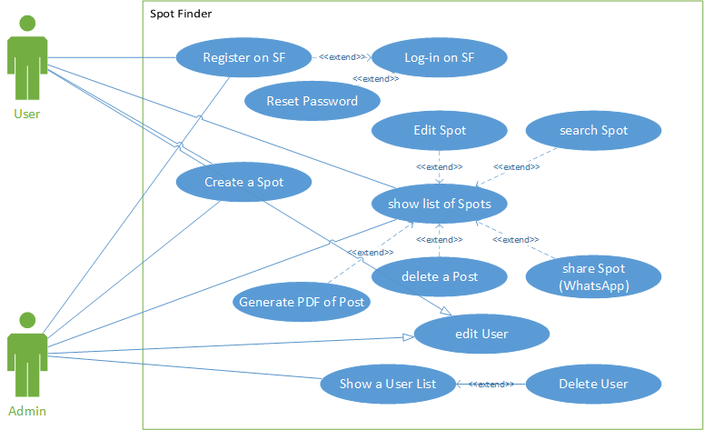
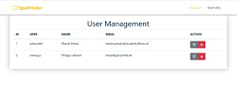
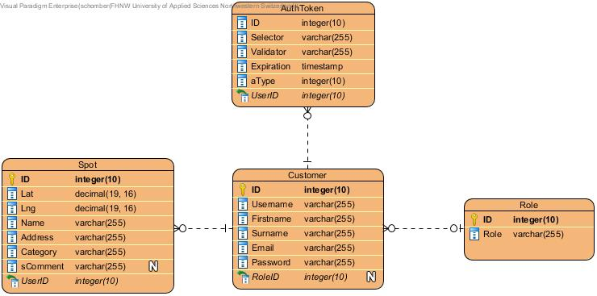
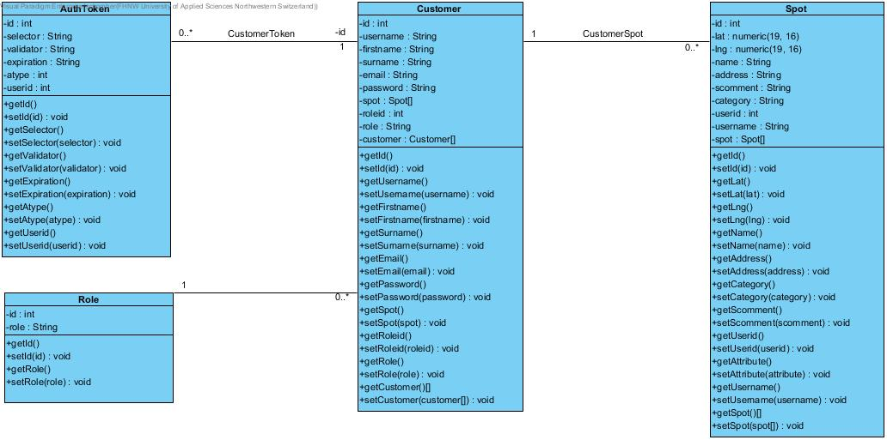

# Spot Finder / Web-Engineering Project@FHNW
# [====>[DEMO](https://peaceful-cliffs-72446.herokuapp.com)<====]
- [Analysis](#analysis)
    - [Scenario](#scenario)
    - [Use Case](#use-case)
- [Design](#design)
    - [ProtoType Design](#prototype)
    - [Information Systems (Layering) Architecture](#information-systems-layering-architecture)
- [License](#license)

## Analysis

### Scenario
Drone Spot Finder is a student project by Martin Peraic and Philipp Labhart. 
The web application allows users to add, edit and extract drone spots from an interactive map. Additionally a simple user management and spot post management is implemented.
Each registered user has the ability to add a spot. A user can mark the position of the located spot with the help 
of implemented Google Maps features. Further, he can submit some more information by additional input (e.g. Category, Comment, Name). 
The user is able to view a list of all submitted spots when entering the page. A possibility to search, edit,
delete (only posts submitted by this user except he is an admin) or share(WhatsApp) or extract the post(PDF generated).


### Use Case



- UC-1 [Login on Drone Spot Finder]: Users or Admins can log-in by entering an email address and password. As an extension, new user may register first.
- UC-2 [Register on WE-CRM]: User can register to get an account (profile) to access the Spot Finder system.
- UC-3 [Create Spot]:  Users are able to create new spots post, by submitting the location and additional inputs.
- UC-4 [Show a list of Spots]: Users can view a list of all spots submitted.
- UC-5 [Edit a Post]: Each user is able to edit it's own posts.
- UC-6 [Delete a Spot]: Each user is able to delete it's own posts.
- UC-7 [Search Spot]:  Users are able to search for spots, by submitting the location address into the search input on the spot list.
- UC-8 [Share Post]:  Users are able to share spots by clicking the WhatsApp button.
- UC-9 [Generate a PDF of Spot Post]: Each user can  pull the selected spot information. All information of the spot is converted into a PDF File, which can be downloaded.
- UC-10 [Delete User]: Admins are able to delete users.
- UC-11 [Show User List]: Admins can view a list of all registered Users.
- UC-11 [Edit User]: Admins and user can edit his or all user profiles.
- UC-12 [elevate User]: the first registered users and further on all admins have the possibility to elevate to higher access rights.
- UC-13 [Reset Password by Mail]: As stated, registered users can reset the login password by mail (located on login screen)

## Design

### ProtoType 
We first created a draft version with the help of bootstrap studio, which was later updated to the productive version.
#### User Management (basics)



### Database / PostgreSQL
The database is build with PostgreSQL
The following images shows the structure of the DB


### Domain Model


### DAO

### ---


## Structure of Project
├───config  /includes Autoloader   
├───controller /Controller Classes   
├───dao  /Data Object Classes  
├───database  /Database Access Class  
├───design  - markdown images and BootStrap Studio File  
├───domain  /Domain Classes  
├───http  /HTTP Exception, Header, Status Code and Status Header  
├───router  / router class  
├───services  / Application Logic -> Auth, Email, PDF, Role, SpotService  
├───sql  / Export of DB Structure  
└───view  /View Files  
&nbsp;&nbsp;&nbsp;&nbsp;&nbsp;&nbsp;&nbsp;&nbsp;&nbsp;&nbsp;&nbsp;&nbsp;└───assets  /includes js, css and img assets  
&nbsp;&nbsp;&nbsp;&nbsp;&nbsp;&nbsp;&nbsp;&nbsp;&nbsp;&nbsp;&nbsp;&nbsp;&nbsp;&nbsp;&nbsp;&nbsp;&nbsp;&nbsp;&nbsp;&nbsp;&nbsp;&nbsp;&nbsp;&nbsp;&nbsp;├───css  
&nbsp;&nbsp;&nbsp;&nbsp;&nbsp;&nbsp;&nbsp;&nbsp;&nbsp;&nbsp;&nbsp;&nbsp;&nbsp;&nbsp;&nbsp;&nbsp;&nbsp;&nbsp;&nbsp;&nbsp;&nbsp;&nbsp;&nbsp;&nbsp;&nbsp;├───img  
&nbsp;&nbsp;&nbsp;&nbsp;&nbsp;&nbsp;&nbsp;&nbsp;&nbsp;&nbsp;&nbsp;&nbsp;&nbsp;&nbsp;&nbsp;&nbsp;&nbsp;&nbsp;&nbsp;&nbsp;&nbsp;&nbsp;&nbsp;&nbsp;&nbsp;├&nbsp;&nbsp;&nbsp;&nbsp;&nbsp;&nbsp;&nbsp;&nbsp;&nbsp;└───fav  
&nbsp;&nbsp;&nbsp;&nbsp;&nbsp;&nbsp;&nbsp;&nbsp;&nbsp;&nbsp;&nbsp;&nbsp;&nbsp;&nbsp;&nbsp;&nbsp;&nbsp;&nbsp;&nbsp;&nbsp;&nbsp;&nbsp;&nbsp;&nbsp;&nbsp;└───js  

## Libs and Vendors
There are several external libaries used for this projects:  
### Libraries
- jQuery 3.3.1
- BootStrap JS 4.3.1
- FontAwesome 4.7.0
- ionIcons
- lineAwesome
- BootStrap 4.1.3
- Google Maps API (requires API KEY)
### Vendors
- [hypdf PDF Generator](https://hypdf.com/info/index)  
- [SendGrid Email Service](https://sendgrid.com/)
- [Google Maps API](https://cloud.google.com/maps-platform/?hl=de)

#

## Code Re-Use from WE-CRM Project 
The structure of the project is based on the WE-CRM Framework by [@Andreas Martin](https://github.com/andreasmartin)  
The follwing classes/interfaces are copied with medium- to minor changes
- Autoloader.php
- Config.php
- AuthDAO.php
- AuthToken.php
- Database.php
- HTTP- Exception, Header, StatusCode, StatusHeader.php
- PDFServiceClient.php
- AuthService.php
- EmailServiceClient.php
- Router (works like a charm :)
- TemplateView.php
- LayoutRendering.php

You can find the Repo here -> [WE-CRM](https://github.com/webengfhnw/WE-CRM)
Thanks for providing such detailed and well suited instructions for this project.
### Information Systems (Layering) Architecture


## Installation:
1. Clone Repo ```[SpotFinder](git@github.com:schomber/SpotFinder.git)```
2. Import DB Query
3. Log-in to SpotFinder (first User can elevate itself to Admin)
4. Enjoy Life

## Tools used
##### Visual Paradigm 
##### Bootstrap Studio
##### PHPStorm
##### Git
##### PostgreSQL 11
##### XAMPP
The project contains a .gitignore file to keep certain API Keys out of version control.
### Heroku Deployment
[](https://heroku.com/deploy)
## Maintainer
- [Martin Peraic & Philipp Labhart]
## License
- [Apache License, Version 2.0](LICENSE)
