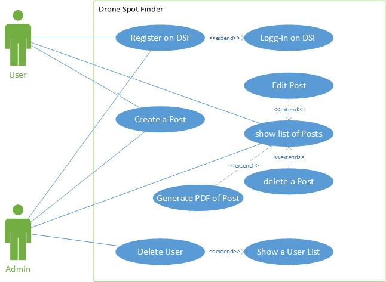

# Drone Spot Finder / Web-Engineering Project@FHNW

- [Analysis](#analysis)
    - [Scenario](#scenario)
    - [Use Case](#use-case)
- [Design](#design)
    - [Information Systems Modelling](#information-systems-modelling)
    - [Information Systems (Layering) Architecture](#information-systems-layering-architecture)
- [License](#license)

## Analysis

### Scenario
Drone Spot Finder is a student project of Martin Peraic and Philipp Labhart. 
The web application allows users to add, edit and extract drone spots. Additionally a user management, blog post management is embedded.
Each registered User has the possibility to add a spot by creating a spot post. He is able to mark the position of the drone with the help 
of Google Maps. Further, he can submit some more information by comments. The user is able to view a list of all submited spots. A possibility 
to delete (only submitted by this user) or extract (out of all submitted spots)the post is possible (PDF generated).

### Use Case

- UC-1 [Login on Drone Spot Finder]: Users or Admins can log-in by entering an email address and password. As an extension, new user may register first.
- UC-2 [Register on WE-CRM]: Agents can register to get an account (profile) to access the WE-CRM system.
- UC-3 [Edit a customer]: Agents can create, update and delete customers.
- UC-4 [Show a customer list]: Agents can get an overview over their customers based on a customer list. As an extension they can create, update and delete customers (UC-3), generate a PDF (UC-5) or send an email (UC-6).
- UC-5 [Generate a PDF customer list]: Agents can generate a PDF containing a list of their customers.
- UC-6 [Send customer list via email]: Agents can send an email containing a list of their customers to their own inbox.

## Design

### Information Systems Modelling

### Information Systems (Layering) Architecture

## Implementation

### Stage 1: Building a Static Website with Bootstrap

In stage 01 a bootstrap based prototype has been created by using a prototyping application. 

#####  Postgresql Database Generation

#### Git
The project contains a .gitignore file to keep certain 

### Heroku Deployment

## Maintainer

- [Andreas Martin](https://github.com/andreasmartin)

## License

- [Apache License, Version 2.0](LICENSE)
