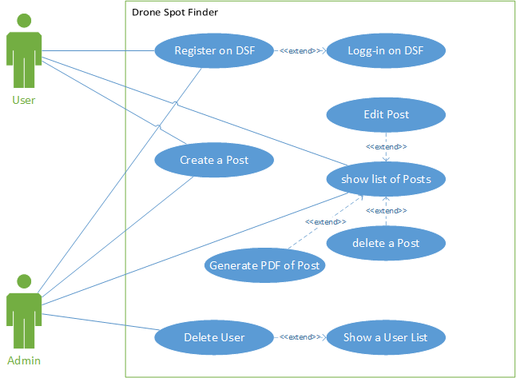

# Drone Spot Finder / Web-Engineering Project@FHNW

- [Analysis](#analysis)
    - [Scenario](#scenario)
    - [Use Case](#use-case)
- [Design](#design)
    - [Information Systems Modelling](#information-systems-modelling)
    - [Information Systems (Layering) Architecture](#information-systems-layering-architecture)
- [License](#license)

## Analysis

### Scenario
Drone Spot Finder is a student project of Martin Peraic and Philipp Labhart. 
The web application allows users to add, edit and extract drone spots. Additionally a user management, blog post management is embedded.
Each registered User has the possibility to add a spot by creating a spot post. He is able to mark the position of the drone with the help 
of Google Maps. Further, he can submit some more information by comments. The user is able to view a list of all submited spots. A possibility 
to delete (only submitted by this user) or extract (out of all submitted spots)the post is possible (PDF generated).

### Use Case

- UC-1 [Login on Drone Spot Finder]: Users or Admins can log-in by entering an email address and password. As an extension, new user may register first.
- UC-2 [Register on WE-CRM]: User can register to get an account (profile) to access the Drone Spot Finder system.
- UC-3 [Create Post]:  Users are able create spots post, by submitting the location and additional comments.
- UC-4 [Show a post list]: Users can view a list of all spots submitted.
- UC-5 [Edit a Post]: Each user is able to edit it's own posts.
- UC-6 [Delete a Post]: Each user is able to delete it's own posts.
- UC-7 [Generate a PDF of Spot Post]: Each user to pull the spot information. All information of the post is converted into a PDF File, which can be downloaded.
- UC-8 [Delete User]: Admins are able to delete users.
- UC-9 [Show User List]: Admins can view a list of all registered Users.

## Design

### Information Systems Modelling

### Information Systems (Layering) Architecture

## Tools

#### Git
The project contains a .gitignore file to keep certain 

### Heroku Deployment

## Maintainer

- [Andreas Martin](https://github.com/andreasmartin)

## License

- [Apache License, Version 2.0](LICENSE)
