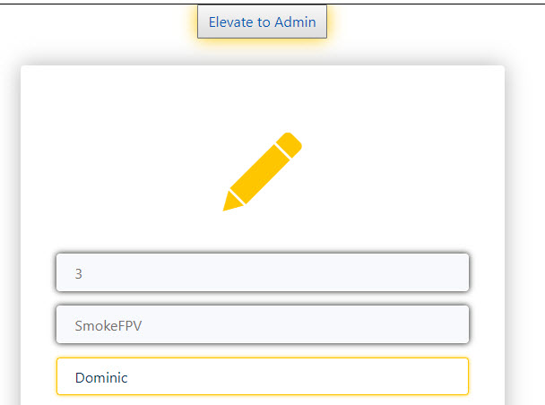
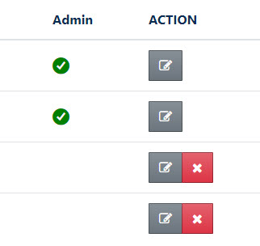
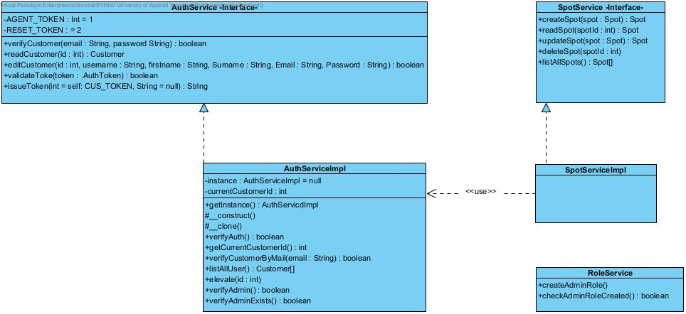
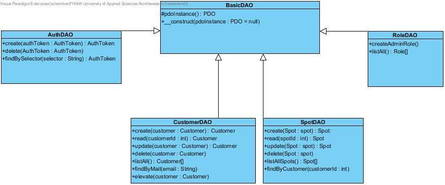
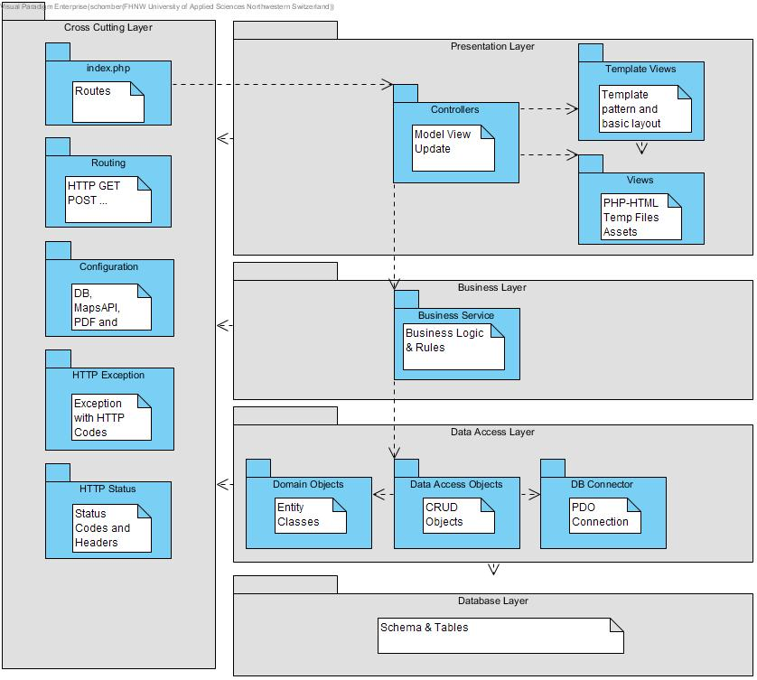

# Spot Finder / Web-Engineering Project@FHNW
# [====>[DEMO](https://peaceful-cliffs-72446.herokuapp.com)<====]
- [Analysis](#analysis)
    - [Scenario](#scenario)
    - [Use Case](#use-case)
- [Design](#design)
    - [ProtoType Design](#prototype)
    - [Business Logic](#business-logic)
    - [Data Access Layer](#data-access-layer)
    - [Database Layer](#database-layer)
- [Overview](#Overview)
    - [Architecture](#layering-structure)
    - [Structure of Work](#structure-of-project)
    - [Libs and Vendors](#libs-and-vendors)
    - [Env Vars](#Env-Vars)
    - [Code Re-Use](#code-re-use)
- [Application explained](#spotfinder)
- [Installation](#installation)
- [Tools used](#tools)
- [Maintainer](#maintainer)
- [License](#license)

## Analysis

### Scenario
Drone Spot Finder is a student project by Martin Peraic and Philipp Labhart. 
The web application allows users to add, edit and extract drone spots from an interactive map. Additionally a simple user management and spot post management is implemented.
Each registered user has the ability to add a spot. A user can mark the position of the located spot with the help 
of implemented Google Maps features. Further, he can submit some more information by additional input (e.g. Category, Comment, Name). 
The user is able to view a list of all submitted spots when entering the page. A possibility to search, edit,
delete (only posts submitted by this user except he is an admin) or share(WhatsApp) or extract the post(PDF generated).


### Use Case


- UC-1 [Login on Drone Spot Finder]: Users or Admins can log-in by entering an email address and password. As an extension, new user may register first.
- UC-2 [Register on WE-CRM]: User can register to get an account (profile) to access the Spot Finder system.
- UC-3 [Create Spot]:  Users are able to create new spots post, by submitting the location and additional inputs.
- UC-4 [Show a list of Spots]: Users can view a list of all spots submitted.
- UC-5 [Edit a Post]: Each user is able to edit it's own posts.
- UC-6 [Delete a Spot]: Each user is able to delete it's own posts.
- UC-7 [Search Spot]:  Users are able to search for spots, by submitting the location address into the search input on the spot list.
- UC-8 [Share Post]:  Users are able to share spots by clicking the WhatsApp button.
- UC-9 [Generate a PDF of Spot Post]: Each user can  pull the selected spot information. All information of the spot is converted into a PDF File, which can be downloaded.
- UC-10 [Delete User]: Admins are able to delete users.
- UC-11 [Show User List]: Admins can view a list of all registered Users.
- UC-11 [Edit User]: Admins and user can edit his or all user profiles.
- UC-12 [elevate User]: the first registered users and further on all admins have the possibility to elevate to higher access rights.
- UC-13 [Reset Password by Mail]: As stated, registered users can reset the login password by mail (located on login screen)

## Design
### ProtoType 
We first created a draft version with the help of bootstrap studio, which was later updated to the productive version.
Check the demo for a full experience of the User Interface
#### User Management (basics)


### Business Logic
The business logic is straight forward and similiar to the WE-CRM.  
The RoleServiceImpl is special, as we didn't want to implement a full role service with multiple roles.
Only one role is required for this simple 1st version of the program (Admins). This role can be created by the first login of the first customer. This 
Customer has the ability to initially elevate himself to an Admin (1st Admin of Application after Deployment).

The  purpose of this function is to check initially if any role (id) exists (Use Case: First ever user of application edits his own profile)  
  

```
    public function checkAdminRoleCreated() {
        $roleDAO = new RoleDAO();
        if(count($roleDAO->listAll())<1){
            return true;
        }
        return false;
    }
```
if not -> DAO creates a new Role [id 1] with the name Admin
```
    public function createAdminRole() {
        $stmt = $this->pdoInstance->prepare('
      INSERT INTO role (role)
        SELECT :role
    ');
        $stmt->bindValue(':role', "admin");
        $stmt->execute();
    }
```
In a next step, the user must be elevated by the AuthServiceImpl
```
    public function elevate($id){
        if($this->verifyAuth()){
            $customer = new Customer();
            $customer->setId($id);
            $customerDAO = new CustomerDAO();
            if(((is_null($customerDAO->read($id)->getRoleid()) && $this->verifyAdminExists()) || $this->verfiyAdmin())) {
                $customerDAO->elevate($customer);
            }
        }
    }
```
if successful, a check mark on the user list shows up  



#### Design Decisions:

Users should never have the possibility to delete or edit spots from other users. 
A user should not see the user list, as this could lead to problems.
An Administrator should never have the possibility to delete him self or other Administrators.   

##### Search Spot
A search must be implemented. At some point to many spots will fill the page, and it gets hard to find the desired place to fly.
For this purpose we included a search form into the spotList.

The search is performed by the "listSpotsBySearch" function.
It checks if the input is empty first. If not, we pull the array of existing spots and store it locally to further filter the array with array_filter().
```
    public static function listSpotsBySearch(){
        $contentView = new TemplateView("spotList.php");

        if ($_POST['searchtext'] !== "") {
            $contentView->spots = array_filter((new SpotServiceImpl())->listAllSpots(), function($spot){
                $search = $_POST["searchtext"];
                $spotAddress = $spot->address;
                return (strpos(strtolower($spotAddress), strtolower($search)) !== false);

            });
            LayoutRendering::basicLayout($contentView);
        } else {
            Router::redirect("/");
        }

    }
```  
##### Google Maps - API
When adding a spot to the database, multiple inputs are required.  
The address / lat / lng inputs are automatically filed out as soon as the user clicks on the the map a certain location.  
This limitation helps us to prevent further validation of the address and lat or lng values.

```javascript
    google.maps.event.addListener(map, 'click', function(event) {
        marker.setPosition();
        myLatlng = {lat: event.latLng.lat(), lng: event.latLng.lng()};
        marker.setPosition(myLatlng);
        cityCircle.setCenter(myLatlng);
        toggleBounce();
        geocodeLatLng(geocoder, map, myLatlng);
        printLatLong(myLatlng);
    });
``` 
On top, we added the feature of geolocation (user must accept that the app pulls location data from his device)
This function automatically pulls the present location from the user and adds it to the map. Otherwise a default Location is set (Basel)
```javascript
    // HTML 5 Geolocation
    if (navigator.geolocation) {
        navigator.geolocation.getCurrentPosition(function(position) {
            myLatlng = {
                lat: position.coords.latitude,
                lng: position.coords.longitude
            };

            marker.setPosition(myLatlng);
            cityCircle.setCenter(myLatlng);
            geocodeLatLng(geocoder, map, myLatlng);
            printLatLong(myLatlng);

            map.setCenter(myLatlng);
        }, function() {
            handleLocationError(true, infoWindow, myLatlng);
        });
    } else {
        // Browser doesn't support Geolocation
        handleLocationError(false, infoWindow, map.getCenter());
    }
}
``` 


### Data Access Layer
#### Domain Model
A php class representation of each DB table of the application (Class, Object).

#### DAO
We use Data Access Objects to access the Database Layer.

### Database Layer
#### Database
The database is build with PostgreSQL
The following image shows the structure of the DB


##Overview
### Layering Structure
Full representation of application architecture


### Structure of Project
├───config  /includes Autoloader   
├───controller /Controller Classes   
├───dao  /Data Object Classes  
├───database  /Database Access Class  
├───design  - markdown images and BootStrap Studio File  
├───domain  /Domain Classes  
├───http  /HTTP Exception, Header, Status Code and Status Header  
├───router  / router class  
├───services  / Application Logic -> Auth, Email, PDF, Role, SpotService  
├───sql  / Export of DB Structure  
└───view  /View Files  
&nbsp;&nbsp;&nbsp;&nbsp;&nbsp;&nbsp;&nbsp;&nbsp;&nbsp;&nbsp;&nbsp;&nbsp;└───assets  /includes js, css and img assets  
&nbsp;&nbsp;&nbsp;&nbsp;&nbsp;&nbsp;&nbsp;&nbsp;&nbsp;&nbsp;&nbsp;&nbsp;&nbsp;&nbsp;&nbsp;&nbsp;&nbsp;&nbsp;&nbsp;&nbsp;&nbsp;&nbsp;&nbsp;&nbsp;&nbsp;├───css  
&nbsp;&nbsp;&nbsp;&nbsp;&nbsp;&nbsp;&nbsp;&nbsp;&nbsp;&nbsp;&nbsp;&nbsp;&nbsp;&nbsp;&nbsp;&nbsp;&nbsp;&nbsp;&nbsp;&nbsp;&nbsp;&nbsp;&nbsp;&nbsp;&nbsp;├───img  
&nbsp;&nbsp;&nbsp;&nbsp;&nbsp;&nbsp;&nbsp;&nbsp;&nbsp;&nbsp;&nbsp;&nbsp;&nbsp;&nbsp;&nbsp;&nbsp;&nbsp;&nbsp;&nbsp;&nbsp;&nbsp;&nbsp;&nbsp;&nbsp;&nbsp;├&nbsp;&nbsp;&nbsp;&nbsp;&nbsp;&nbsp;&nbsp;&nbsp;&nbsp;└───fav  
&nbsp;&nbsp;&nbsp;&nbsp;&nbsp;&nbsp;&nbsp;&nbsp;&nbsp;&nbsp;&nbsp;&nbsp;&nbsp;&nbsp;&nbsp;&nbsp;&nbsp;&nbsp;&nbsp;&nbsp;&nbsp;&nbsp;&nbsp;&nbsp;&nbsp;└───js  

### Libs and Vendors
There are several external libaries used for this projects:  
#### Libraries
- jQuery 3.3.1
- BootStrap JS 4.3.1
- FontAwesome 4.7.0
- ionIcons
- lineAwesome
- BootStrap 4.1.3
- Google Maps API (requires API KEY)
#### Vendors
- [hypdf PDF Generator](https://hypdf.com/info/index)  
- [SendGrid Email Service](https://sendgrid.com/)
- [Google Maps API](https://cloud.google.com/maps-platform/?hl=de)

###Env Vars
To run the project succesfully, ENV-Vars need to be set. Below a template:
```
[database]
database.dsn="pgsql:host=<host>;port=<port>;dbname=<nameofDB>;sslmode=disable"
database.user=""
database.password=""
   
[google]
google.apikey=""
   
[pdf]
pdf.hypdf-user=""
pdf.hypdf-password=""
   
[email]
email.sendgrid-apikey=""
```

### Code Re-Use 
The structure of the project is based on the WE-CRM Framework by [@Andreas Martin](https://github.com/andreasmartin)  
The follwing classes/interfaces are copied with medium- to minor changes
- Autoloader.php
- Config.php
- AuthDAO.php
- AuthToken.php
- Database.php
- HTTP- Exception, Header, StatusCode, StatusHeader.php
- PDFServiceClient.php
- AuthService.php
- EmailServiceClient.php
- Router (works like a charm :)
- TemplateView.php
- LayoutRendering.php

You can find the Repo here -> [WE-CRM](https://github.com/webengfhnw/WE-CRM)
Thanks for providing such detailed and well suited instructions for this project.

##SpotFinder  
A brief explanation of how this app works.
FPV or First Person View is an emerging hobby related to the field of drones.
Take a look at Martins Instagram Profile to understand why this application could be handy.
[2LCFPV@instagram](https://www.instagram.com/2lcfpv/)
Lets compare it to Skateboarding. "Oh, look at this rail, I'd love to grind that". The same wow-effect appears in FPV. 
People find spots to fly frequently, but there is no possibility to share places except by Google Maps and WhatsApp.
This application helps pilots to store, find and share spots to fly all around the world.

1. First you need to Login or if not yet registered a quick sign up is required(this prevents trolls from posting).
2. After successful login, you get forwarded to the landing page (a list of stored spots appears)
3. You are now able to search (by entering the address into to the search field)  
or you can simply scroll through the existing spots. Just click on a spot if you would like to get further details.
4. You can "add" a spot by clicking the "+ Spot" button in the navigation. Enter all the required information and submit it to the server.
5. No worries, if you made a mistake, you can edit or delete your spot easily. 
6. You are also able to change certain information about your profile. Just click on the "MyProfile" -> "Ediit" Button in the navigation.
7. Share a spot on the list by clicking the WhatsApp button. 
8. Extract the spot -> create a PDF with all information from the spot included.

 Administrator do have some extra features.
- Click on "myProfile" -> UserList to find all users signed up to this application.
- You can edit evey user in the list. 
- You can't delete yourself or other administrators
- Administrators are marked with a check box.
- You can elevate existing user to admins (simply edit the desired user profile and click the button "Elevate to Admin")
- You are able to edit and delete all spots from the spot list (regular user can only edit they're own created spots)

Additional Features:
- Wrong password? no worry, you can simply reset your password. Go to the login page and press "Oops, I forgot my password".  
You get prompted to enter your email. After submit, you will receive a email with further instrutions.
- The application will remember your login for 30 days if you click "Remember me" at the login page.
## Installation:
1. Clone Repo ```[SpotFinder](git@github.com:schomber/SpotFinder.git)```
2. Import DB Query
3. Copy & Paste ENV Config -> fill out
4. Log-in to SpotFinder (first User can elevate itself to Admin)
5. Enjoy Life

## Tools
##### Visual Paradigm 
##### Bootstrap Studio
##### PHPStorm
##### Git
##### PostgreSQL 11
##### XAMPP
The project contains a .gitignore file to keep certain Keys out of version control.
### Heroku Deployment
[](https://heroku.com/deploy)
## Maintainer
- [Martin Peraic & Philipp Labhart]
## License
- [Apache License, Version 2.0](LICENSE)
